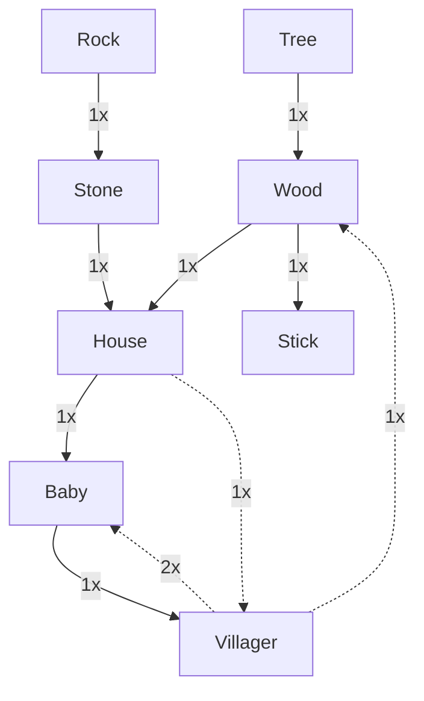
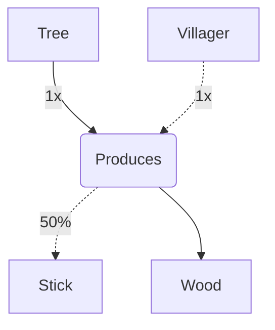
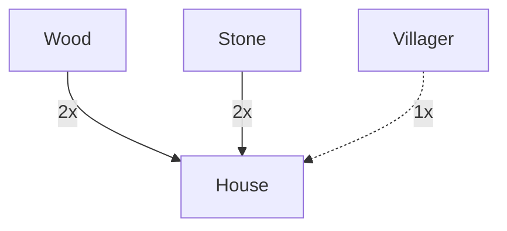
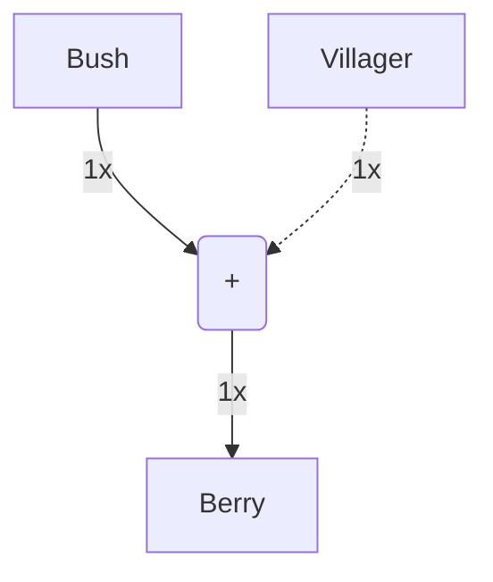
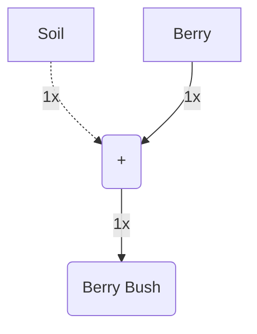
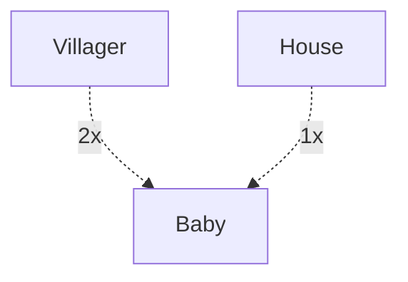
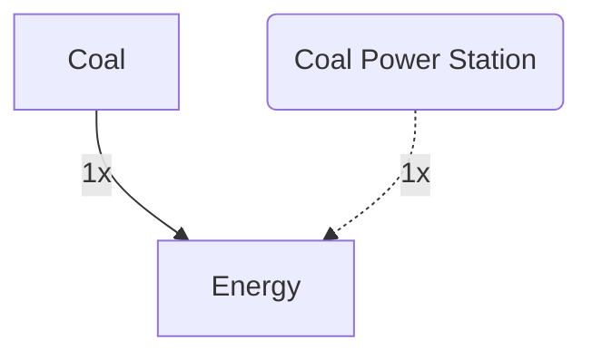

https://www.cluemediator.com/draggable-rectangle-on-canvas-using-react
# Card Game

## Ideas

- Farming
  - Soil
  - Farm,...)
- Industry
  - Mine
  - Oil
  - Energy
  - Water
  - Microchips
  - ...
- Trading (
  - Markt
  - Coins
  - ...
- Exploration
  - Forest
  - Mointain
  - ...
- Fight
  - Enemies
  - Turrets
  -...
- Expansion
  - Map size increases
  - ...

## Card Categories

- Building
  - isConsumable: `false` (default)
- Ingredient
  - isConsumable: `true` (default)
  - Quantity
- Person
  - isConsumable: `false` (default)
  - Health
  - (Hunger)
- Animal
  - isConsumable: `true` (default)
  - Health
  - (Hunger)
- Enemy
  - isConsumable: `true` (default)
  - Health
- Plant
- Resource
  - isConsumable: `true` (default)
  - quantity

# Crafting

## Recepie

- duration
- ingredients
  - count
  - consumed
- outcome
- quantity

## Crafting Tree



## Example

### Wood / Stick



```json
{
    "id": "tree",
    "category": "recource",
    "quantity": 5,
    "producible": [
        {
            // Ingredient
            "id": "wood",
            "probability": 1
        },
        {
            // Ingredient
            "id": "sticks",
            "probability": 0.5
        }
    ]
}
```

### House



```json
{
    "id": "house",
    "quantity": 1,
    "duration": 30,
    "ingredients": [
        {
            // Ingredient
            "id": "wood",
            "count": 2,
            "isConsumable": true
        },
        {
            // Ingredient
            "id": "stone",
            "count": 2,
            "isConsumable": true
        },
        {
            // Person
            "id": "villager",
            "count": 1,
            "isConsumable": false
        }
    ]
}
```

```js
const persons = {
    villager: new GameObject({
        id: "villager",
        category: "person",
        args: {
            title: "Villager"
        },
        recipes: [
            [
                {
                    id: "baby",
                    count: 1,
                    isConsumable: true
                },
                {
                    id: "house",
                    count: 1,
                    isConsumable: false
                }
            ]
        ]
    })
};
```

### Berry



```json
// TODO
```

### Berry Bush



```json
// TODO
```


### Baby



```json
// TODO
```

### Energy



```json
{
    "id": "energy",
    "quantity": 1,
    "duration": 30,
    "ingredients": [
        {
            // Ingredient
            "id": "coal",
            "count": 1,,
            "isConsumable": true
        },
        {
            // Building
            "id": "coal-power-station",
            "count": 1,
            "isConsumable": true
        }
    ]
}
```


## GameObject

```ts
class GameObject {
    id: string;
    category: string;
    args: any;
    recipes: any[];
    constructor(params: { id: string; category: string; args: any; recipes: any[] }) {
        this.id = params.id;
        this.category = params.category;
        this.args = params.args;
        this.recipes = params.recipes;
    }

    get isCraftable() {
        return this.recipes.length > 0;
    }
}
```
